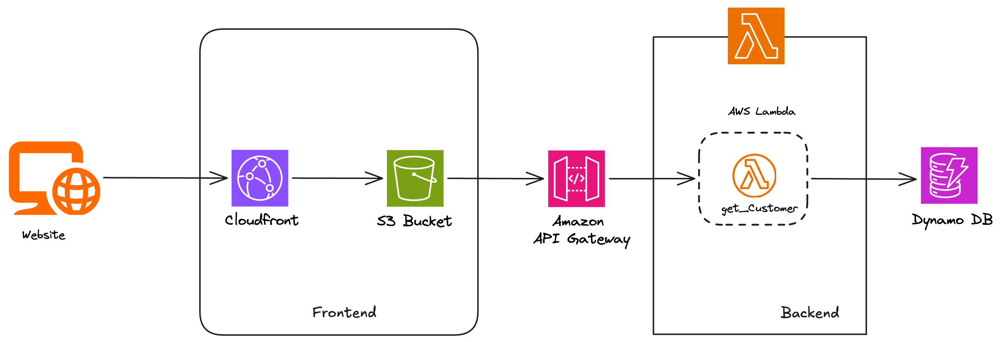
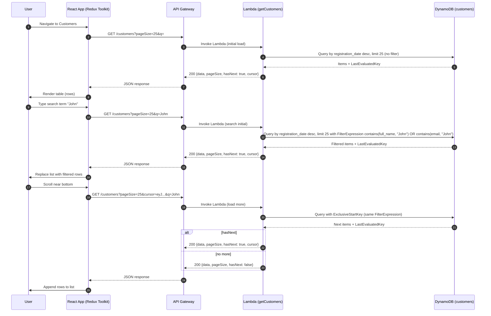

# Customer Data Explorer

A full-stack web application for exploring customer data with infinite scroll and search functionality. Built with React, TypeScript, Redux Toolkit, AWS Lambda, API Gateway, and DynamoDB.

Live application: https://d2do4hucyqhan4.cloudfront.net/

## Features

- **Infinite Scroll**: Load more customers as you scroll
- **Search**: Search by name or email
- **Responsive UI**: Material UI components
- **Serverless Backend**: AWS Lambda with API Gateway
- **Data Storage**: DynamoDB with GSI for efficient queries

## Architecture



## Sequence Diagram



*For more details, refer to [docs/tech-design.md](docs/tech-design.md)*

## Quick Start

### Prerequisites

- Node.js 20
- AWS CLI configured with credentials
- CDK bootstrapped account

### Local Development

1. **Clone and install dependencies**
   ```bash
   git clone <repo-url>
   cd cbus-assessment

   # Frontend
   cd frontend/customer-explorer
   npm install

   # Backend
   cd ../../backend/lambda
   npm install
   npm run build
   ```

2. **Start frontend dev server**
   ```bash
   cd frontend/customer-explorer
   npm run dev
   ```
   Open http://localhost:5173

3. **Run tests**
   ```bash
   # Frontend
   cd frontend/customer-explorer
   npm run test

   # Backend
   cd ../../backend/lambda
   npm run test
   ```

### Deployment

1. **Deploy infrastructure and frontend**
   ```bash
   cd infra/cdk
   npm run cdk deploy
   ```

2. **Seed data**
   ```bash
   cd ../db
   npm run seed
   ```

3. **Access the application**
   - Frontend: Check CDK outputs for `FrontendUrl`
   - API: Check CDK outputs for `ApiGatewayUrl`

## API Usage

See [API Documentation](docs/api.md) for endpoint details.

Example:
```bash
curl "https://<api-id>.execute-api.<region>.amazonaws.com/prod/customers?pageSize=25&q=John"
```

## Documentation

- [Functional Requirements](docs/functional-requirements.md)
- [Technical Design](docs/tech-design.md)
- [Local Runbook](docs/local-runbook.md)
- [API Reference](docs/api.md)
