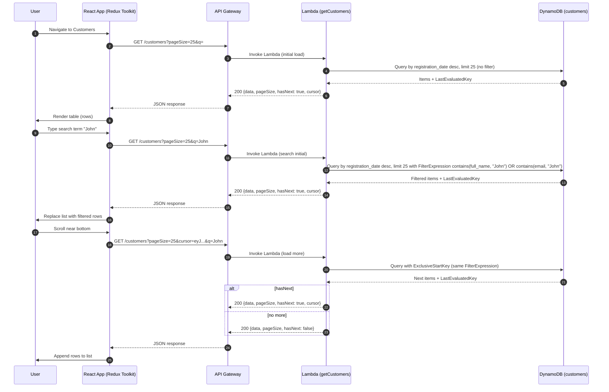

# Tech Design — Customer Data Explorer (4-hour build)

## Overview
A simple, cost-effective Full Stack React app with an AWS Lambda + API Gateway backend that lists customers with basic pagination. Optimized for free-tier and speed of delivery while demonstrating senior-level structure, testing, and security practices.

 - Frontend: React + TypeScript + Redux Toolkit
- Backend: AWS Lambda (Node.js 18) + API Gateway (REST)
- Data Store (free-tier path): DynamoDB (customers table)
- IaC: AWS CDK (TypeScript)
- CI: GitHub Actions (build/test), optional CDK deploy with manual approval

Note: Original plan chose RDS. Given time and free-tier constraints, DynamoDB is the simpler, cheaper serverless choice. An RDS variant is outlined at the end.

---

## Prerequisites (AWS Account & Credentials)
These steps ensure your environment can deploy and run the stack. Perform them manually before development/deploy.

- Create AWS account
  - Go to https://aws.amazon.com/ and create a new account.
  - Sign in as the root user (email used to create the account).
  - Enable MFA on the root user (Security best practice).

- Recommended: Create an IAM user for CLI/CDK (do not use root keys)
  - In AWS Console → IAM → Users → Add user (e.g., `cbus-dev`), select "Access key - Programmatic access".
  - Attach policy: `AdministratorAccess` (for fast CDK setup in a sandbox account). You can restrict later.
  - Create access key; download the `.csv` securely.

- If you still choose root access keys (not recommended)
  - In AWS Console → My Security Credentials → Access keys → Create access key.
  - AWS strongly advises against root access keys; remove them after setup and prefer IAM.

- Configure credentials on macOS (Terminal)
  - Using AWS CLI (preferred):
    ```bash
    aws configure
    # Enter AWS Access Key ID
    # Enter AWS Secret Access Key
    # Default region: ap-southeast-2  # choose your region
    # Default output format: json
    ```
  - Or export environment variables for the current shell:
    ```bash
    export AWS_ACCESS_KEY_ID="<YOUR_ACCESS_KEY_ID>"
    export AWS_SECRET_ACCESS_KEY="<YOUR_SECRET_ACCESS_KEY>"
    export AWS_DEFAULT_REGION="ap-southeast-2"
    ```
  - Optional per-project credentials file:
    - Create `~/.aws/credentials` and `~/.aws/config` with a named profile (e.g., `cbus`).
    - Use `AWS_PROFILE=cbus` during CDK/CLI commands.

- Security hygiene
  - Never commit keys to git; use environment variables or AWS profiles.
  - Rotate keys periodically; delete unused keys.
  - Consider using AWS SSO for long-lived developer access.

---

## Goals & Non-Goals
- Goals: Paginated list, robust API contract, validation, predictable errors, accessibility basics, unit tests, minimal CI.
- Non-goals: Complex auth, advanced filtering/sorting, heavy observability, multi-env promotion.

---

## Architecture
- API Gateway exposes `/customers` (GET) with query params `pageSize` and optional `cursor`, plus optional `q` for search.
 - Lambda validates params, queries DynamoDB via a GSI on `registration_date` (descending) and returns items with pagination metadata.
- Frontend consumes the endpoint, renders a responsive table with infinite scrolling (auto load-more on near-bottom) and client-controlled search input.

### Components
- React App: `CustomersTable`, `InfiniteScrollSentinel`, `store/customersSlice` (Redux Toolkit)
- Lambda: `getCustomers.handler` with `validateQuery`, `queryCustomers`, `mapResponse`
- DynamoDB: `customers` table (PK: `id` [UUID], GSI: `registration_date_index`)
- IaC (CDK): VPC (optional), DynamoDB, Lambda, API Gateway, IAM roles & CORS

---

## API Contract
Endpoint: `/customers`

Query params:
- `pageSize` (number, 1..100, default 25)
- `cursor` (string, optional, opaque token)
- `q` (string, optional, case-sensitive search term)

Response (200):
```
{
  "data": [
    { "id": "c_123", "fullName": "Jane Doe", "email": "jane@example.com", "registrationDate": "2024-10-01T12:00:00Z" }
  ],
  "pageSize": 25,
  "hasNext": true,
  "cursor": "eyJMYXN0RXZhbHVhdGVkS2V5IjoiLi4uIn0="
}
```

Errors:
- 400: `{ "error": { "code": "VALIDATION_ERROR", "message": "pageSize must be in 1..100" } }`
- 500: `{ "error": { "code": "INTERNAL_ERROR", "message": "Unexpected error" } }`

Notes:
- Infinite scroll friendly: the first call omits `cursor`; subsequent calls include the returned `cursor`.
- `cursor` is an opaque token (e.g., encoded `LastEvaluatedKey`) and may change between requests.
- Search behavior: if `q` is null/empty, return all; else return items where `fullName` OR `email` contains `q` (case-insensitive).

---

## Data Model (DynamoDB)
Table: `customers`
- `id`: string (PK)
- `first_name`: string
- `last_name`: string
- `email`: string (unique-ish, not enforced)
- `registration_date`: ISO8601 string (UTC)
- `full_name`: string (materialized `first_name + ' ' + last_name` for search)

Indexes:
- GSI `registration_date_index` with `registration_date` as sort key; supports recent-first queries.

Seeding:
- CDK Custom Resource or one-off script to insert ~1–5k synthetic rows.

---

## Lambda Logic (getCustomers)
- Parse and validate `pageSize`; accept optional `cursor` and `q`.
- Initial load: Query GSI for latest `registration_date` with `Limit = pageSize`.
- Load more: If `cursor` present, pass as `ExclusiveStartKey`.
- If `q` present: apply FilterExpression `contains(full_name, :q) OR contains(email, :q)` (case-insensitive) on the query.
- Map items to `{ id, fullName, email, registrationDate }`.
- Return `{ data, pageSize, hasNext, cursor? }`.

Security & Resilience:
- Input validation and bounds for `pageSize`.
- JSON-only responses; consistent error envelopes.
- CORS: Allow All.
- Timeouts: Lambda 6–10s; retries off for idempotent reads.
- Performance note: FilterExpression runs server-side but still reads items; acceptable for demo scale. For larger datasets, consider dedicated GSIs per search need or full-text offload.

---

## Frontend Design (React + Redux Toolkit + MUI)
Store: `customersSlice`
- State: `{ data, pageSize, hasNext, cursor, q, loading, error }`
- Thunks: `fetchInitial(pageSize, q)`, `fetchMore(cursor, pageSize, q)`
- Selectors: `selectCustomers`, `selectHasNext`, `selectCursor`, `selectSearchTerm`

Components:
- UI Library: Material UI (MUI) for consistent components and styling
- `CustomersTable`: MUI `Table`, `TableHead`, `TableRow`, `TableCell` with headers: ID, Full Name, Email, Registration Date
- `InfiniteScrollSentinel`: IntersectionObserver sentinel to trigger `fetchMore` when near bottom; debounced to avoid duplicate calls; show MUI `CircularProgress` when loading
- `SearchBar`: MUI `TextField` controlled input updating `q`; debounced submit resets list and cursor, triggers `fetchInitial(pageSize, q)`

Accessibility:
- Semantic `<table>` with `<thead>`/`<tbody>`
- Button labels, ARIA live region for pagination feedback
- Color contrast via system defaults
 - Leverage MUI accessibility defaults and props (e.g., `aria-label` on `TextField`)

---

## Sequence Diagram


---

## Technology Stack

### AWS Components (Cloud Infrastructure)
- **AWS Lambda**: Serverless compute for API backend (Node.js 18 runtime)
- **Amazon API Gateway**: REST API management with CORS support
- **Amazon DynamoDB**: NoSQL database with Global Secondary Index (GSI) for efficient queries
- **Amazon S3**: Static website hosting for frontend assets
- **Amazon CloudFront**: Content Delivery Network (CDN) for global distribution
- **AWS Identity and Access Management (IAM)**: Role-based access control and permissions
- **AWS CloudFormation**: Infrastructure provisioning via CDK
- **AWS CDK**: Infrastructure as Code framework (TypeScript)

### Frontend Technologies
- **React 19**: UI framework with hooks and modern features
- **TypeScript**: Type-safe JavaScript for better developer experience
- **Vite**: Fast build tool and development server
- **Redux Toolkit**: State management with async thunks
- **Material UI (MUI)**: React component library for consistent UI
- **React Testing Library**: Testing utilities for React components
- **Jest**: JavaScript testing framework

### Backend Technologies
- **Node.js 18/20**: JavaScript runtime environment
- **TypeScript**: Type-safe backend development
- **AWS SDK v3**: Official AWS JavaScript SDK
- **Jest**: Backend testing framework

### Development & DevOps Tools
- **npm**: Package management and scripts
- **GitHub Actions**: CI/CD platform for automated testing and deployment
- **ESLint**: Code linting and quality enforcement
- **Prettier**: Code formatting (implied in project structure)
- **Faker.js (@faker-js/faker)**: Synthetic data generation for testing/seeding

### Data & Configuration
- **DynamoDB GSI**: `registration_date_index` for efficient pagination queries
- **Environment Variables**: Vite environment variables for API configuration
- **CORS Configuration**: Cross-origin resource sharing for web app access

---
Frontend (Jest + RTL):
- `CustomersTable` renders rows and headers
- `InfiniteScrollSentinel` triggers load more when visible
- `SearchBar` debounces input and triggers `fetchInitial` with `q`
- thunks `fetchInitial` and `fetchMore` handle success and error states; ensure no duplicate requests and proper reset on new `q`

Backend (Jest):
- `validateQuery` for bounds and types
- `queryCustomers` returns items and `hasNext`
- error mapping produces envelopes with correct status codes

---

## CI/CD (GitHub Actions)
- `ci.yml`: Node 18, install, lint, test (frontend/backend)
- `deploy.yml`: CDK synth; manual approval; deploy to one dev stack

---

## Infrastructure (CDK)
Stack resources:
- DynamoDB: `customers` table + GSI
- Lambda: Node.js 18, env vars, IAM perms for DynamoDB
- API Gateway: REST API, `/customers` route, CORS

Cost (free-tier friendly):
- DynamoDB: within free-tier read/write capacity for demo
- Lambda/API Gateway: minimal cost for infrequent invocations


---

## Future Enhancements
- Filters by date and sorting by name or date
- Auth via Cognito or API Key
- Observability (structured logs, metrics, alarms)
- Stronger accessibility (keyboard shortcuts, focus management)
- Integration tests using LocalStack or AWS SAM
